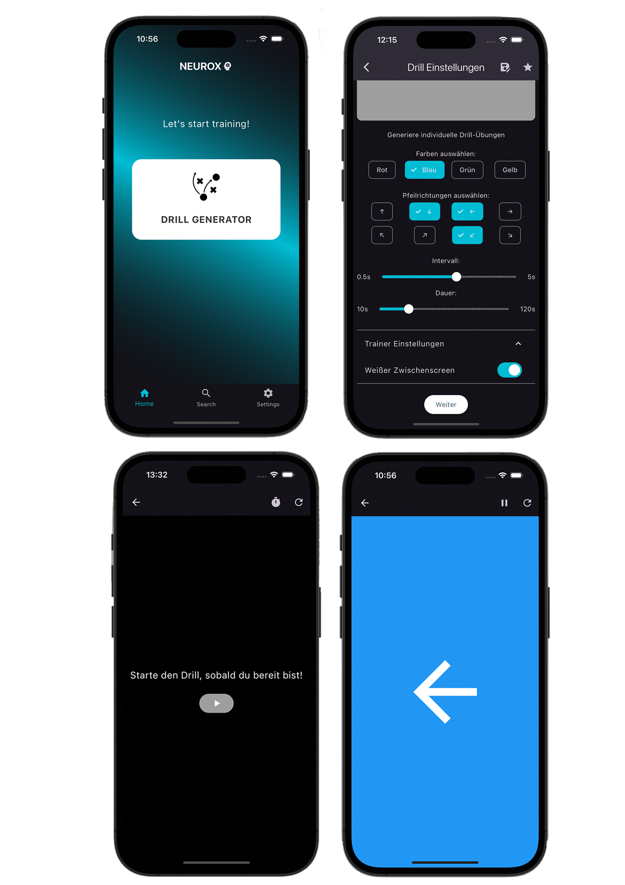

# Neurox Training

A mobile application developed using Flutter to generate customized (neuroathletic) training drills.

## About the Project

This app was developed as part of an advanced seminar at my university THWS Würzburg. The goal of the seminar was to design and implement a mobile solution that addresses a specific problem or need. As a sports enthusiast, I chose to create a neuroathletic training app to help users enhance their performance through customizable training drills.

The first feature, called Drill Generator aims to make neuroathletic training more accessible and user-friendly by providing a platform where users can create, customize, and save their training routines.

By making this project open source, I hope to encourage collaboration and improvements from the community, ensuring that the app can benefit as many people as possible.

## Current Status

Please note that this app is in an early, unstable version. Currently, it only offers one training option: the Drill Generator. However, additional games and features are planned for future releases.

## Features

- Customizable training drills with selectable colors and directions
- Option to include a white screen between drills
- Save and load presets
- Responsive UI

## Screens Overview

## Language

Please note that the app is currently available only in German.

## License

This project is licensed under the GNU General Public License v3.0 - see the [LICENSE](LICENSE) file for details.

## Contact

- Your Name - [anika.menz@study.thws.de](mailto:anika.menz@study.thws.de)
- GitHub: [AniMZ711](https://github.com/AniMZ711)
